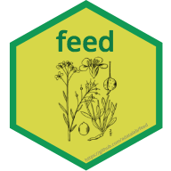

# feed 
## Overview

feed is a tool for getting the information of animal feeds. Basically, it can load, modify, and compare the animal feed dataset from Animal Feed Resources Information System (INRA CIRAD AFZ and FAO).   

## Installation  
``` r
# install.packages("remots")
remotes::install_github("adatalab/feed")
```

## Usage
``` r
library(feed)
```

### Feed information
#### feed_list
`feed_list` function shows the list of feeds of [feedipedia.org](https://www.feedipedia.org/).

``` r
# All feeds
feed_list(category = "all")

# Forage plants
feed_list(category = "forage")

# Plant products/by-products
feed_list(category = "plantProduct")

# Feeds of animal origin
feed_list(category = "animalOrigin")

# Other feeds
feed_list(category = "other")
```

#### feed_search
`feed_search` function shows the results found at [feedipedia.org](https://www.feedipedia.org/). When you find the result (in the R or Web) that you want, copy the url for scraping the feed data using `feed_info` function.      

``` r
feed_search("maize")
```

#### feed_info
`feed_info` function shows the nutritive values of the specific feedstuff(url) in the form of a list. If you use extract option, a list is returned for each nutrient composition of the specific feed.

``` r
# get the information about the url
feed_info(url = "https://www.feedipedia.org/node/556")

# extract 2nd objects of nutrient composition dataset list
feed_info(url = "https://www.feedipedia.org/node/556", extract = 2)
```

#### feed_compare
`feed_compare` function compares each result of feed composition.

``` r
# extract the result
feed1 <- feed_info("https://www.feedipedia.org/node/556", 2)
feed2 <- feed_info("https://www.feedipedia.org/node/674", 3)

# extract the main analysis results
feed1 <- feed1[[1]]
feed2 <- feed2[[1]]

# compare the results
feed_compare(feed1, feed2, radar = TRUE)
```

### Conversion
#### dm_asis
`dm_asis` function converts dry-matter basis into as-is basis.

``` r
df <- data.frame(nutrient=c("CP", "NDF", "EE", "Ash"), composition = c(10, 30, 5, 2))
dm_asis(composition=df$composition, dm = 85, digits = 2)
```

#### asis_dm
`asis_dm` function converts as-is basis into dry-mater basis.

``` r
df <- data.frame(nutrient = c("CP", "NDF", "EE", "Ash"), composition = c(10, 30, 5, 2))
asis_dm(composition = df$composition, dm = 85, digits = 2)
```

#### j_cal
`j_cal` function converts joule into calorie.  

``` r
j_cal(joule = 4000, standard = "15")
```

#### cal_j
`cal_j` function converts calorie into joule.  

``` r
cal_j(cal = 5000, standard = "15")
```

### Dataset
## Notification
**This package is under development.**

## Getting helps
Email: ruminoreticulum@gmail.com
